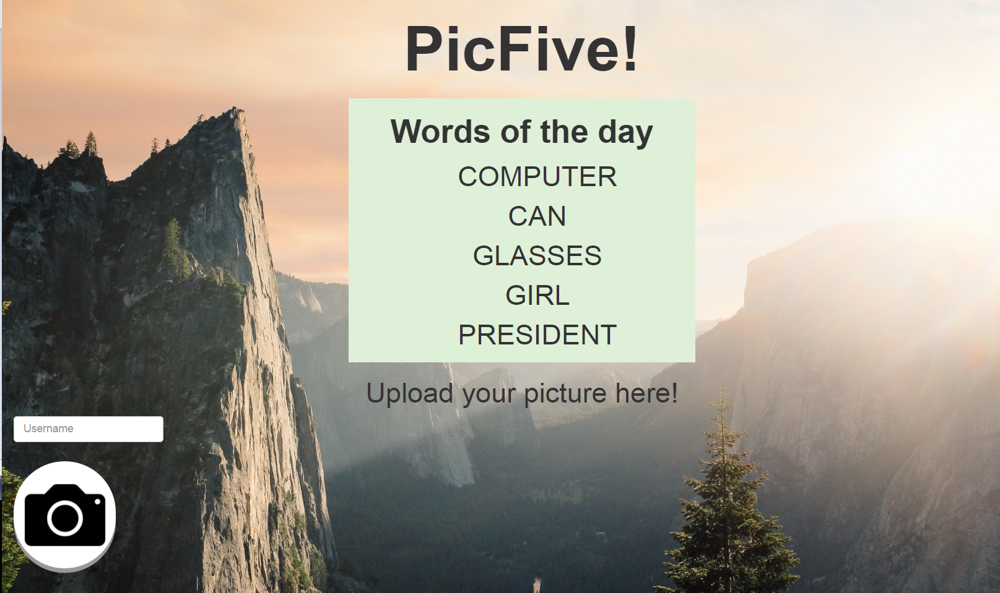
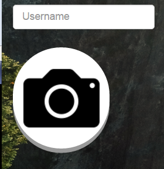
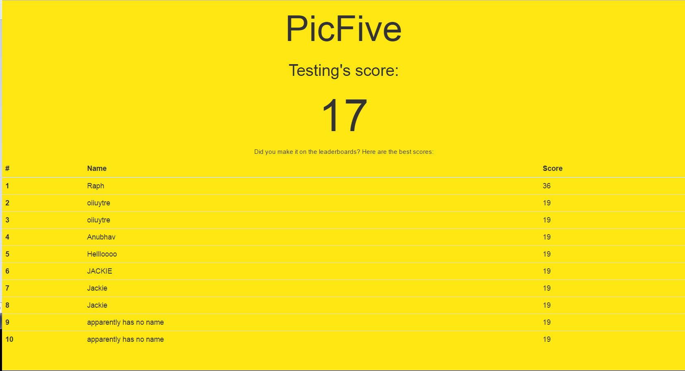

# PicFive
PicFive is a web-based game where users must take a picture that falls into as many of the five categories as possible. After submitting the picture, the player is given a score that is determined by the degree to which the photo matches each of the categories. The results are then stored in a database, and the top 10 scores are presented to the player.

The game implements Computer Vision and Machine Learning through Clarifai API. 

The game was developed during UofT Hacks IV in January, 2017. Our initial goal was to develop an application using the ClairifaiAPI, which allows us to process images in highly meaningful ways using image recognition. Ultimately, we created a social game thet encourages exploration and creativity. 

To improve this project, we would improve the user interface and experience. Authentication would be implemented, both locally and using common social media such as Facebook, Twitter, and Google. Users would have the ability to share their scores and invite their friends to participate in the daily challenge.

#### To run this locally:
  1. Clone this repo
  2. Make sure you have the latest release of `node` and `npm`
  3. Run `npm install` and then `nodemon`
  4. The resolver endpoint will now be accessible at: `http://localhost:5000/`

# Demonstration
The front of the website should look something like this.  
  
Note that the five keywords are "Computer", "Can", "Glasses", "Girl", and "President".  
Find an image that best matches these keywords as accurately as possible.  
Once you found an image, you can upload it on the bottom left corner of the page, by clicking the camera icon.  
You can optionally insert a username so that your username can be associated with your score if you make it to the leaderboards.  
  
Now wait for a short amount of time for your score to be processed.  
Once your score is processed, a leaderboard screen will appear.  
  
In this case, the username was "Testing", and the calculated score was 17.  
17 was not high enough to reach the leaderboards, so the score will not be displayed on this page.  
If your score is high enough, you will be placed on the leaderboards!  
This is essentially how PicFive works. Try to make it onto the leaderboards by uploading an image which is as relevant as possible to the 5 keywords.  
